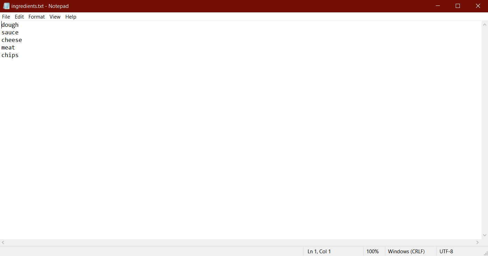

<h1 align="center">
    Recipe Creator 🍝
</h1>

    
    
        
        
     
    
     
     
     
        

# Description 🍕
- A simple python script where the user inputs the current ingredients they have in their kitchen into ingredients.txt 
and then runs the main.py script, and it will output what recipes can be created based upon the ingredients supported.

# Important ⚡
- Certain foods and ingredients like non-sticks (butters or oils), frozen foods, seasonings, and condiments are not supported in the ingredients.txt file. 
For example, if you have bread and eggs, it will be assumed you also have cinnamon, and thus you can make french toast.

# Examples 🍕

# [Requirements](https://github.com/JordanLeich/Recipe-Creator/blob/main/requirements.txt) ⚡
