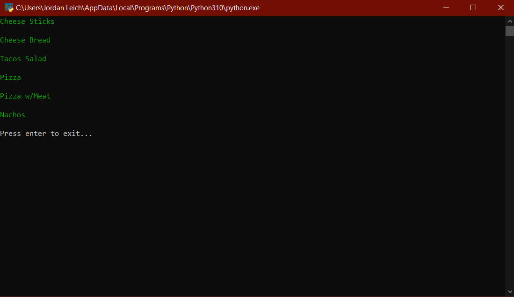

<h1 align="center">
    Recipe Creator 🍝
</h1>

    
    
        
        
    
     
     
     
        

# Description 🍕

- A simple python script where the user inputs the current ingredients they have in their kitchen into ingredients.txt
  and then runs the main.py script, and it will output what recipes can be created based upon the ingredients supported.
- Also includes an .exe version for those who do not have Python installed.

# Examples 🍕

